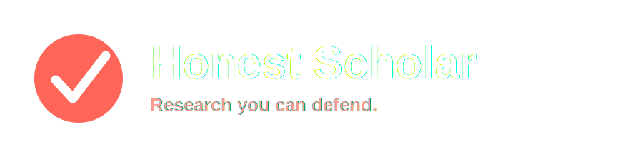
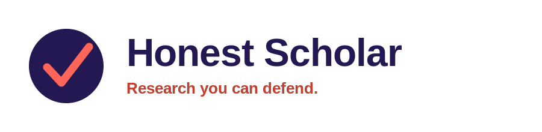
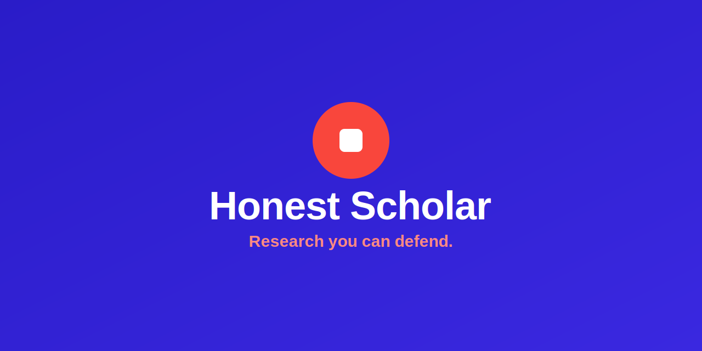

# Visual identity

Honest Scholar's identity is built to read as rigorous, not decorative: a bold
electric blue grounds the system with confidence, a single punchy red accent carries every
call to action and moment of confirmation — the QED square that ends a proof,
the sign-off, the "demonstrated." Quietly confident, understated: built for
researchers evaluating a new tool, not for a landing page.

## Logo

  
  &nbsp;&nbsp;
  

The icon mark (`assets/icon-mark.svg`) is a red circle with a white QED
square (∎, the mark that ends a proof — "demonstrated"), used standalone as the
favicon and app icon at 32/24/16px, and paired with the wordmark in the lockups
above.

**Clearspace & minimum size.** Keep clearspace equal to the icon's radius on
every side. Never render the lockup narrower than 120px, or the icon alone
below 16px.

**Don't:**
- Recolor the mark
- Stretch or skew the lockup
- Add drop shadows or outlines
- Place it on busy imagery

## Color

| Swatch | Name | Hex | Usage |
|---|---|---|---|
| 🟦 | Electric Blue | `#2a1cc8` | Primary — headers, dark surfaces, wordmark text on white (gradient to `#3a28e0`) |
| 🟥 | Red | `#f9463c` | Accent — mark, CTAs, confirmations. Never for large fills |
| ⬜ | White | `#ffffff` | Base for docs, README body, light surfaces |
| ⬛ | Ink | `#1c1533` | Body text on white |
| ◻️ | Muted | `#8b7fae` | Captions, secondary labels |

## Typography

- **Display — Space Grotesk** (weights 500–700): headlines, wordmark, section labels.
- **Body — Source Sans 3** (weights 400–700): docs, README prose, UI copy.
- **Mono — JetBrains Mono**: code, CLI commands, badges, technical labels.

## Applications

**README header:**

**Badges** use `labelColor=2a1cc8` (electric blue) and `color=f9463c` (red), flat-square style — see the shields.io URLs in the root `README.md`.

**Social preview** (GitHub repo social image, 1280×640):

## Voice

Rigorous, plain, anti-hype. Say what the tool does, not how exciting it is.
Quietly confident: no exclamation points, no "revolutionize," no unearned
superlatives. Precise verbs over adjectives — "traces," "retires," "verifies,"
not "seamlessly" or "powerful."

## Assets

All source files live in [`assets/`](../../assets):

- `icon-mark.svg` — app icon / favicon source (512×512)
- `wordmark-banner.svg` — README header (1200×300)
- `docs-hero.svg` — docs page hero banner (1600×420)
- `nav-logo-light.svg` — compact nav lockup (icon + wordmark) for light nav bars
- `nav-logo-dark.svg` — compact nav lockup (icon + wordmark) for dark nav bars
- `wordmark-lockup-light.svg` — horizontal lockup, transparent, for light surfaces
- `wordmark-lockup-dark.svg` — horizontal lockup, transparent, for dark surfaces
- `social-preview.svg` — GitHub social preview (1280×640)
